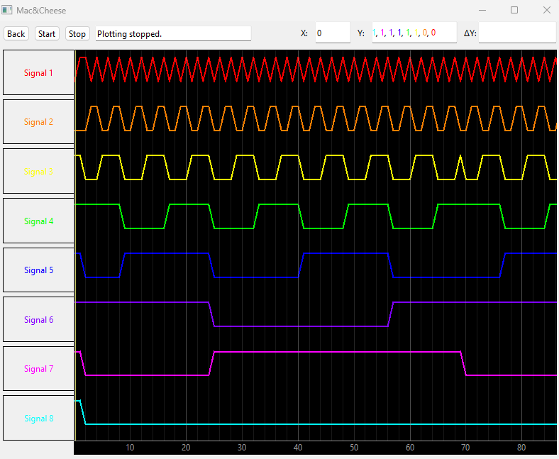

# MacNCheese

## Overview:
#### Tufts ECE Sr. Design Capstone Project by Henry Ammirato, Lucas Polidori, Matt Silva, Kevin Sui ('24)
This project is a VHDL Logic Analyzer designed to be implemented within the Tufts ES4 Class as a simpler alternative to modern simulation software. It is intended for use with the ICE405K Upduino and Lattice Radiant IDE although it can be adopted to other IDEs and FPGAs. 

It consists of VHDL components that are to be added to a VHDL project in order to record the logic within and send it to a computer over a USB connection along with a software component that is to be downloaded and run in order to read the data being sent and recorded from the FPGA. It is essentially an integrated logic analyzer for use within any FPGA project.

#### Example read from an 8 bit counter:

## Setup:
### VHDL:
#### Youtube Video: [Setup Description](https://www.youtube.com/watch?v=Jvebyqo9Zz0)
Above is a youtube video giving a detailed description on what this project is, how it works, and most importantly, how to add it to your Radiant projects moving forward. The following steps are all covered within the video.

Running the setup.py script in the directory of a Lattice Radiant project will automatically this process by add the files, add the components into your top file, and edit the pinout file accordingly

### Manual Steps:
1. Download and link VHDL Files into Lattice Radiant project
2. Add the MNC component to your top level module
3. Port map signals and generics according to the descriptions within their comments to your top module
4. Edit pin-out file according to MNC signal descriptions
5. Synthesize and flash your FPGA

### Software:
- Download and run executeable files from releases tab on the right of main page
- Currently do not have working executeables for M1/M2 Macs or Linux

## File Info:
- example.zip: Full Lattice Radiant example project displayed in video containing all vhdl files and showcasing an implementation of MacNCheese Logic analyzer to record the data displayed by a simple counter
- setup.py: python3 script used to automatically import the MNC VHDL module into any Lattice Radiant VHDL project
   - The required dependencies should be included in the default installation of python3
- vhdl_files: folder containing all necessary vhdl files for the logic analyzer
     - MNC.vhd is the highest level module of the logic analyzer project
     - uart_tx and uart_rx may be helpful for anyone looking to use SPI communications on other Upduino projects
- GUI_files: folder containing all files used for the development of the software aspect
   - Added for the case of future developments on the software
   - Created using PyQt6 and Python Qt Designer

## Known Issues / Future Feature Requests
* Would like to see reduction in variables/ports
  * byterate and use_ext_clk can realistically be merged to one value by allowing byterate = 0 to set use_ext_clk to '1'
  * NUM_INPUTS could be removed from generic map
  * ADDR_WIDTH could be calculated from any given input NUM_SAMPLES within the VHDL
  * use_ram could potentially be set/removed such that the system is always writing to RAM, but also reading at the same speed, or however fast possible.
    * system will automatically exit if RAM ever gets filed up
* setup.py not always working for Radiant Projects
    * pins file needs to be initiated in Radiant by setting up >= 1 output prior to running current version of script
    * .rdf file for .vhd source linkings has a few different formats it chooses to write in and current script only works for one method. In my short analysis of the software, I could not deduce how to identify which format it will use
